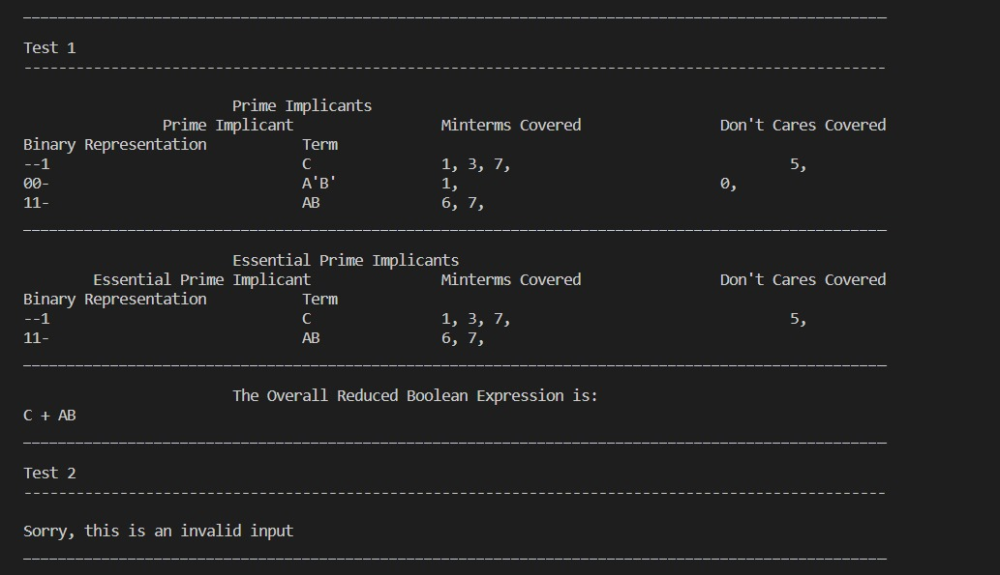

# Digital Project 1 - Minimizing boolean expressions using Quine McCluskey Algorithm

The project is about implementing the Quine McLuskey Algorithm to minimize boolean expression and generate Prime Implicants and Essential Prime Implicants. 

The output of the project is demonstated in the screenshot:

## Folder Structure:
We have 2 classes: `QmAlgo` and `Implicant`.

- `Implicant`: Has the definitions of an implicant with all the necessary details (binary format, decimal format, implicant in characters e.g. (AB'C)).
- `QmAlgo`: Have all the implementation  details of the algorithm, along with printing the output.

We also have the `main.cpp` file, where we take the input and validate it and call the algorithm through the `QmAlgo` class.

As we believe in testing, we created a `TestCasesGenerators.cpp` file, to generate many random test cases so to validate that our algorithm is working as intented, and you can verify this by checking the input and output generated through the code (Input: `testValid.in`, Output: `testValidOutput.out`).

## Group Members: 
- Islam Mahdy: 900213579
- Reem Said: 900201275
- Gehad Ahmed: 900205068

